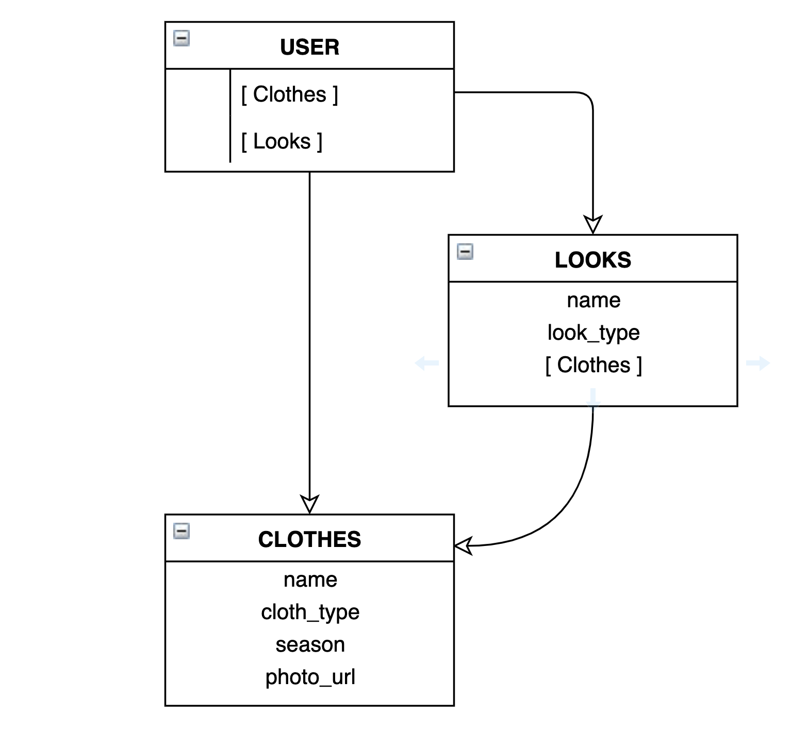

# My E-Closet

## Introduction

My eCloset is an app that helps you to keep all your clothes in virtuals closets, where you can choose severals pieces of cloth and combine between them to keep your looks, and put them in a calendar.

## DATA MODEL



### USER MODEL

KEY             | TYPE       | REFERENCE     | REQUIRED | VALIDATIONS
--------------- | ------     |-------------  | ---------|-------------
email           | String     |               | true     | regex(email)
name            | String     |               | true     |
gender          | String     |               | true     | enum: man, woman
password        | String     |               | true     | min(6)
img_url         | String     |               |          | -
created_at      | Number     |               |          | -

### CLOTH MODEL

KEY        | TYPE       | REFERENCE | REQUIRED | VALIDATIONS / DEFAULT
---------- | --------   | --------- | -------- | ---------------
user       | ObjectId   | user      | true     | -
name       | String     | -         | true     | -
img_url    | String     | -         | true     | -
cloth_type | String     | -         | true     | enum: ..., others
season     | String     | -         | default: all  | enum: winter, summer, all

#### LOOK MODEL

KEY           | TYPE       | REFERENCE | REQUIRED | VALIDATIONS / DEFAULT
--------      | ---------- | --------- | -------- | ---------------
name          | String     | -         | true     | -
user          | ObjectId   | user      | true     | -
clothes       | [ObjectId] | cloth     |          | -


## API ROUTES
Please note that all routes in this API should be called with the `/api` prefix before the endpoint:

```
POST http://DOMAIN/api/auth/signup
```

### AUTHENTICATION ENDPOINTS
> TOKEN Required: NO

METHOD | URL            | What does it do
------ | -------------- | --------------------
POST   | `/auth/signup` | Create a new account
POST   | `/auth/login`  | Authenticates a user

### USER ENDPOINTS
> TOKEN Required: YES

METHOD | URL              | What does it do
------ | -----------------| ------------------------
GET    | `/me`            | Get Current User
PUT    | `/me`            | Update Current User
DELETE | `/me`            | Delete Current User

### CLOTHS ENDPOINTS
> TOKEN Required: YES

METHOD | URL                   | What does it do
------ | --------------------- | ------------------------------------------
GET    | `/me/clothes`          | Get All My clothes
POST   | `/me/clothes`          | Add A cloth
GET    | `/me/clothes/:id`      | Get A cloth by Id
DELETE | `/me/clothes/:id`      | Delete cloth

### LOOKS ENDPOINTS
> TOKEN Required: YES

METHOD | URL              | What does it do
------ | ---------------  | -----------------------
GET    | `/me/looks/`     | Get All My Looks
POST   | `/me/looks/`     | Create A Looks
GET    | `/me/looks/:id`  | Get a Look by Id
PUT    | `/me/looks/:id`  | Update Look by Id
DELETE | `/me/looks/:id`  | Delete Look by Id
POST   | `/me/looks/:id/addCloth`     | Adds a Cloth to my look
DELETE | `/me/looks/:id/removeCloth`  | Remove a Cloth to my look
